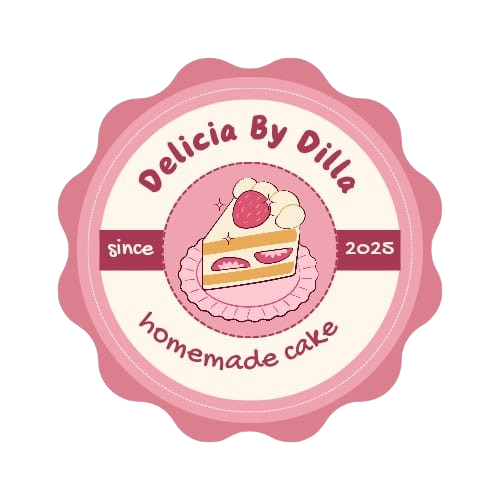
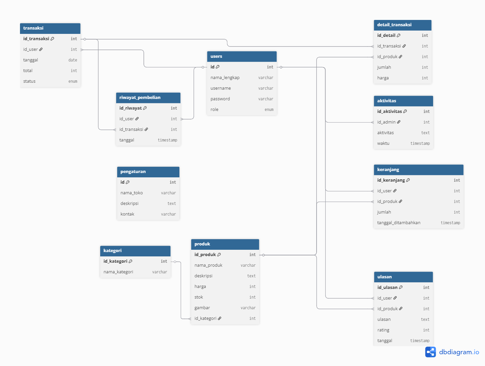

# 🧁✨ Delicia by Dilla - Sweet Dreams Come True ✨🧁

<div align="center">
  
  
  [](https://www.php.net/)
  [](https://www.mysql.com/)
  [](LICENSE)
  
  **💖 Sistem Manajemen Toko Kue Online yang Manis & Professional 💖**
  
  *Aplikasi web e-commerce untuk toko kue dengan tampilan pink aesthetic yang menggemaskan*
</div>

---

## 🌸 **Meet the Developer** 🌸

<div align="center">
  <table>
    <tr>
      <td align="center">👩‍💻</td>
      <td><strong>Nama</strong></td>
      <td>Sardilla</td>
    </tr>
    <tr>
      <td align="center">🎓</td>
      <td><strong>NIM</strong></td>
      <td>202312071</td>
    </tr>
    <tr>
      <td align="center">💌</td>
      <td><strong>Email</strong></td>
      <td>dillasardilla387@gmail.com</td>
    </tr>
    <tr>
      <td align="center">🏫</td>
      <td><strong>Program Studi</strong></td>
      <td>Teknik Informatika</td>
    </tr>
    <tr>
      <td align="center">🏛️</td>
      <td><strong>Institusi</strong></td>
      <td>Sekolah Tinggi Teknologi Bontang</td>
    </tr>
    <tr>
      <td align="center">📚</td>
      <td><strong>Proyek</strong></td>
      <td>Ujian Akhir Semester - Pemrograman Web</td>
    </tr>
  </table>
</div>

---

## 📚 **Dokumentasi Lengkap**

Untuk informasi lebih detail tentang proyek ini, silakan kunjungi dokumentasi lengkap berikut:

### 📖 **Dokumentasi Utama**
- 🏠 **[Beranda](README.md)** - Dokumentasi utama proyek (halaman ini)
- 🗄️ **[Database](docs/Database.md)** - Schema database dan struktur tabel
- 🚀 **[Installation](docs/Installation.md)** - Panduan instalasi lengkap step-by-step
- 📦 **[Deployment](docs/Deployment.md)** - Panduan deploy ke production server
- 🎯 **[Usage](docs/Usage.md)** - Panduan penggunaan fitur-fitur aplikasi

### 📋 **Quick Navigation**
- [👩‍💻 Developer Info](#-meet-the-developer-) | [📖 Deskripsi](#-deskripsi-proyek) | [✨ Fitur](#-fitur-utama) | [🏗️ Arsitektur](#️-arsitektur-sistem)
- [📁 Struktur](#-struktur-direktori) | [🚀 Instalasi](#-instalasi-dan-setup) | [🖥️ Usage](#️-cara-penggunaan) | [🔒 Security](#-sistem-keamanan)
- [🎨 Design](#-design-system) | [🐛 Issues](#-known-issues--troubleshooting) | [📞 Support](#-support--contact) | [📄 License](#-license)

---

## 📖 **Deskripsi Proyek**

Delicia by Dilla adalah aplikasi web e-commerce yang dirancang khusus untuk toko kue online. Sistem ini memungkinkan pengelolaan produk kue, manajemen user, transaksi pembelian, dan laporan penjualan dengan antarmuka yang user-friendly dan responsif.

### 🎯 **Tujuan Aplikasi**
- Memudahkan pengelolaan bisnis toko kue online
- Menyediakan platform belanja yang mudah untuk customer
- Mengotomatisasi proses transaksi dan laporan penjualan
- Memberikan pengalaman berbelanja yang nyaman dengan desain pink aesthetic

---

## ✨ **Fitur Utama**

### 👑 **Panel Admin**
- **Dashboard**: Statistik user, produk, dan transaksi
- **Manajemen User**: CRUD data pengguna
- **Manajemen Produk**: Tambah, edit, hapus produk kue
- **Manajemen Kategori**: Organisasi produk berdasarkan kategori
- **Manajemen Transaksi**: Monitoring dan pengelolaan pesanan
- **Laporan**: Laporan penjualan dan analisis bisnis
- **Pengaturan Toko**: Konfigurasi informasi toko

### 👤 **Panel User**
- **Dashboard User**: Halaman utama dengan informasi akun
- **Katalog Produk**: Browse dan pencarian produk kue
- **Keranjang Belanja**: Manajemen item yang akan dibeli
- **Checkout**: Proses pembayaran dan pemesanan
- **Riwayat Transaksi**: History pembelian user
- **Profil**: Manajemen informasi akun
- **Ulasan Produk**: Memberikan review dan rating

---

## 🏗️ **Arsitektur Sistem**

### **Tech Stack**
- **Backend**: PHP 8.0+ (Native)
- **Database**: MySQL 5.7+
- **Frontend**: HTML5, CSS3, JavaScript
- **Styling**: Custom CSS dengan tema pink aesthetic
- **Icons**: Font Awesome 6.4.0
- **Fonts**: Google Fonts (Poppins)

### **Struktur Database**

<div align="center">
  
  <p><em>Entity Relationship Diagram - Delicia by Dilla Database</em></p>
</div>

```
📊 Database: delicia_by_dilla
├── users (User dan Admin)
├── kategori (Kategori Produk)
├── produk (Data Produk Kue)
├── keranjang (Shopping Cart)
├── transaksi (Data Transaksi)
├── detail_transaksi (Detail Item Transaksi)
├── ulasan (Review Produk)
├── riwayat_pembelian (History User)
├── aktivitas (Log Aktivitas Admin)
└── pengaturan (Konfigurasi Toko)
```

---

## 📁 **Struktur Direktori**

```
Delicia-by-Dilla/
├── 📁 admin/                    # Panel Admin
│   ├── aktivitas.php           # Log aktivitas admin
│   ├── dashboard.php           # Dashboard admin
│   ├── data_kategori.php       # Manajemen kategori
│   ├── data_produk.php         # Manajemen produk
│   ├── data_transaksi.php      # Manajemen transaksi
│   ├── data_user.php           # Manajemen user
│   ├── detail_transaksi.php    # Detail transaksi admin
│   ├── edit_kategori.php       # Edit kategori
│   ├── edit_produk.php         # Edit produk
│   ├── edit_user.php           # Edit user
│   ├── hapus_kategori.php      # Hapus kategori
│   ├── hapus_produk.php        # Hapus produk
│   ├── hapus_user.php          # Hapus user
│   ├── kategori.php            # Kelola kategori
│   ├── laporan.php             # Laporan penjualan
│   ├── logout.php              # Logout admin
│   ├── pengaturan.php          # Pengaturan toko
│   ├── tambah_kategori.php     # Tambah kategori
│   ├── tambah_produk.php       # Tambah produk
│   └── tambah_user.php         # Tambah user
├── 📁 user/                     # Panel User
│   ├── checkout.php            # Proses pembelian
│   ├── checkout_sukses.php     # Konfirmasi checkout
│   ├── dashboard.php           # Dashboard user
│   ├── detail_produk.php       # Detail produk
│   ├── detail_transaksi.php    # Detail transaksi user
│   ├── hapus_transaksi.php     # Hapus transaksi
│   ├── keranjang.php           # Shopping cart
│   ├── kirim_ulasan.php        # Kirim review produk
│   ├── lihat_produk.php        # Lihat produk
│   ├── logout.php              # Logout user
│   ├── produk.php              # Katalog produk
│   ├── profil.php              # Manajemen profil
│   └── riwayat_pembelian.php   # Riwayat pembelian
├── 📁 assets/                   # Asset statis
│   ├── 📁 css/                 # Stylesheet
│   │   └── style.css           # Main stylesheet
│   ├── 📁 img/                 # Gambar dan media
│   │   ├── gambar1.jpg         # Sample product image
│   │   ├── gambar2.jpg         # Sample product image
│   │   ├── gambar3.jpg         # Sample product image
│   │   ├── gambar4.jpg         # Sample product image
│   │   ├── gambar5.jpg         # Sample product image
│   │   ├── logo.png            # Logo aplikasi
│   │   └── walpaper.jpg        # Background image
│   └── 📁 js/                  # JavaScript files
├── 📁 config/                   # Konfigurasi
│   └── koneksi.php             # Database connection
├── 📁 database/                 # Database schema
│   └── delicia_by_dilla.sql    # Database dump
├── 📁 docs/                     # Dokumentasi tambahan
│   ├── API_DOCS.md             # Dokumentasi API
│   ├── CHANGELOG.md            # Log perubahan
│   └── INSTALL.md              # Panduan instalasi
├── 📁 includes/                 # Include files
│   ├── footer.php              # Footer template
│   ├── header.php              # Header template
│   ├── sidebar_admin.php       # Sidebar admin
│   └── sidebar_user.php        # Sidebar user
├── auth.php                    # Authentication handler
├── cek_login.php               # Login verification
├── index.php                   # Landing page/Dashboard redirect
├── LICENSE                     # License file
├── login.php                   # Halaman login
├── logout.php                  # Global logout handler
├── README.md                   # Dokumentasi utama
└── register.php                # Halaman registrasi
```

---

## 🚀 **Instalasi dan Setup**

### **Prasyarat**
- XAMPP/WAMP/LAMP Stack
- PHP 8.0 atau lebih tinggi
- MySQL 5.7 atau lebih tinggi
- Web browser modern

### **Langkah Instalasi**

1. **Clone atau Download Proyek**
   ```bash
   git clone [repository-url]
   # atau download ZIP dan extract
   ```

2. **Pindahkan ke Direktori Web Server**
   ```bash
   # Untuk XAMPP
   cp -r Delicia-by-Dilla/ C:/xampp/htdocs/
   ```

3. **Setup Database**
   - Buka phpMyAdmin (http://localhost/phpmyadmin)
   - Buat database baru: `delicia_by_dilla`
   - Import file SQL:
     ```sql
     -- Import file: database/delicia_by_dilla.sql
     ```

4. **Konfigurasi Database**
   ```php
   // File: config/koneksi.php
   $host = "localhost";
   $user = "root";
   $pass = "";
   $db = "delicia_by_dilla";
   ```

5. **Jalankan Aplikasi**
   - Start Apache dan MySQL di XAMPP
   - Akses: `http://localhost/Delicia-by-Dilla`
---

## 🖥️ **Cara Penggunaan**

### **Untuk Admin:**
1. Login dengan akun admin
2. Akses dashboard untuk melihat statistik
3. Kelola produk melalui menu "Produk"
4. Monitor transaksi di menu "Transaksi"
5. Lihat laporan penjualan
6. Atur konfigurasi toko

### **Untuk User:**
1. Registrasi akun baru atau login
2. Browse katalog produk
3. Tambahkan produk ke keranjang
4. Lakukan checkout
5. Lacak status pesanan
6. Berikan ulasan produk

---

## 🔒 **Sistem Keamanan**

### **Fitur Keamanan yang Diimplementasikan:**
- ✅ Session-based authentication
- ✅ Role-based access control (Admin/User)
- ✅ SQL injection prevention dengan prepared statements
- ✅ XSS protection dengan htmlspecialchars()
- ✅ Password hashing menggunakan MD5
- ✅ Input validation dan sanitization

### **Saran Peningkatan Keamanan:**
- 🔄 Upgrade dari MD5 ke bcrypt/Argon2
- 🔄 Implementasi CSRF protection
- 🔄 HTTPS enforcement
- 🔄 Rate limiting untuk login attempts

---

## 🎨 **Design System**

### **Color Palette:**
- **Primary**: `#ff69b4` (Hot Pink)
- **Secondary**: `#ed92b8` (Soft Pink)  
- **Accent**: `#d63384` (Deep Pink)
- **Background**: `#fff0f5` (Lavender Blush)
- **Text**: `#333` (Dark Gray)

### **Typography:**
- **Font Family**: Poppins (Google Fonts)
- **Responsive**: Mobile-first approach
- **Icons**: Font Awesome 6.4.0

---

## 🐛 **Known Issues & Troubleshooting**

### **Common Issues:**
1. **Database Connection Error**
   - Pastikan MySQL service berjalan
   - Periksa kredensial database di `config/koneksi.php`

2. **Permission Denied**
   - Set permission folder ke 755
   - Pastikan web server memiliki akses baca/tulis

3. **Session Issues**
   - Pastikan `session_start()` dipanggil di setiap halaman
   - Periksa konfigurasi session di PHP

### **Debugging:**
- Enable error reporting di development
- Periksa log Apache/PHP untuk error details
- Gunakan developer tools browser untuk debug frontend

---

## 🔄 **Changelog**

### **Version 1.0.0** (Current)
- ✨ Initial release
- ✨ Complete admin panel
- ✨ User shopping system
- ✨ Transaction management
- ✨ Product catalog with categories
- ✨ Review and rating system

### **Future Updates:**
- 🚀 Payment gateway integration
- 🚀 Email notifications
- 🚀 Advanced reporting
- 🚀 Mobile app API
- 🚀 Multi-language support
---
📹 Demo Video
🎥 https://youtu.be/Qk6Vt6boOSc?si=eiF28q8BiFKs9Pk4

---
🌐 Hosting
Aplikasi dapat diakses melalui:
🔗 https://sardila.mangaverse.my.id

---
🔐 Login Aplikasi

**Admin:**
- Username: `admin`
- Password: `admin123`

**User Demo:**
- Username: `dilla`
- Password: `user123`

---
👩‍💻 Profil Pembuat
-👤 Nama: Sardilla

-🆔 NIM: 202312071

-📘 Mata Kuliah: Pemrograman Web

-🏫 Kampus: STITEK Bontang

-📅 Tugas: Proyek UAS Semester Ganjil 2024/2025

---
## 📞 **Support & Contact**

Jika Anda mengalami masalah atau memiliki pertanyaan:

- **Email**: dillasardilla387@gmail.com
- **GitHub Issues**: [Create Issue](../issues)
- **Documentation**: Baca dokumentasi ini dengan lengkap

---

## 📄 **License**

Proyek ini dibuat untuk keperluan edukasi dalam rangka Ujian Akhir Semester mata kuliah Pemrograman Web di Sekolah Tinggi Teknologi Bontang.

```
Educational License
Copyright (c) 2025 Sardilla - STITEK Bontang
Hanya untuk keperluan pembelajaran dan evaluasi akademik.
```

---

## 🙏 **Acknowledgments**

- **Dosen Pengampu**: Terima kasih atas bimbingan dalam mata kuliah Pemrograman Web
- **STITEK Bontang**: Institusi pendidikan yang memberikan kesempatan belajar
- **Open Source Community**: Untuk resource dan inspirasi
- **Font Awesome**: Untuk icon library
- **Google Fonts**: Untuk typography

---

## 📈 **Technical Specifications**

### **Minimum System Requirements:**
- **PHP**: >= 8.0
- **MySQL**: >= 5.7
- **Apache**: >= 2.4
- **RAM**: 512 MB
- **Storage**: 100 MB

### **Recommended:**
- **PHP**: 8.1+
- **MySQL**: 8.0+
- **RAM**: 1 GB+
- **SSD Storage**: 500 MB+

### **Browser Compatibility:**
- ✅ Chrome 90+
- ✅ Firefox 88+
- ✅ Safari 14+
- ✅ Edge 90+

---

**Dibuat dengan ❤️ oleh Sardilla untuk STITEK Bontang**

---

*Terakhir diperbarui: 19 Juli 2025*
