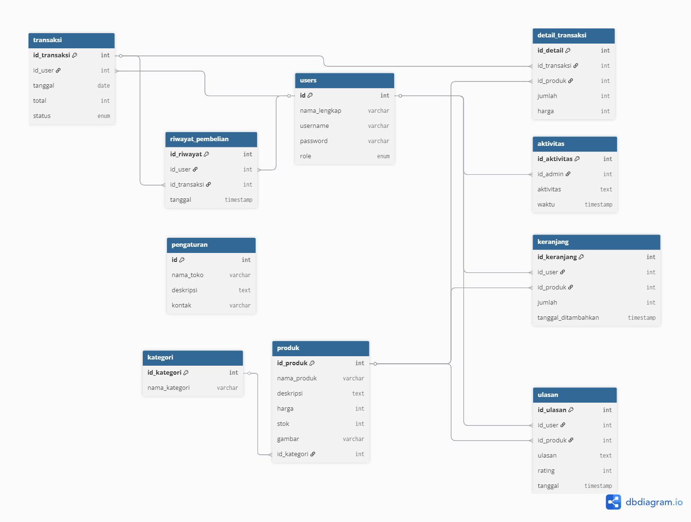

# 🗄️ Database Documentation - Delicia by Dilla

## 📊 Overview

Database `delicia_by_dilla` menggunakan MySQL sebagai sistem manajemen database untuk menyimpan semua data aplikasi toko kue online.

---

## 🏗️ Entity Relationship Diagram

<div align="center">
  
  <p><em>Entity Relationship Diagram - Delicia by Dilla Database</em></p>
</div>

---

## 📋 Database Schema

### Database Name: `delicia_by_dilla`
- **Engine**: InnoDB
- **Charset**: utf8_general_ci
- **Collation**: utf8_general_ci

---

## 📁 Tables Structure

### 1. **users** 👥
Menyimpan informasi pengguna sistem (admin dan user)

```sql
CREATE TABLE users (
    id INT AUTO_INCREMENT PRIMARY KEY,
    nama_lengkap VARCHAR(100) NOT NULL,
    username VARCHAR(50) NOT NULL UNIQUE,
    password VARCHAR(255) NOT NULL,
    role ENUM('admin','user') DEFAULT 'user'
);
```

**Fields:**
- `id` - Primary key, auto increment
- `nama_lengkap` - Nama lengkap pengguna
- `username` - Username untuk login (unique)
- `password` - Password yang di-hash
- `role` - Role pengguna (admin/user)

### 2. **kategori** 🏷️
Kategori produk kue

```sql
CREATE TABLE kategori (
    id_kategori INT AUTO_INCREMENT PRIMARY KEY,
    nama_kategori VARCHAR(100) NOT NULL
);
```

**Fields:**
- `id_kategori` - Primary key kategori
- `nama_kategori` - Nama kategori produk

### 3. **produk** 🧁
Data produk kue yang dijual

```sql
CREATE TABLE produk (
    id_produk INT AUTO_INCREMENT PRIMARY KEY,
    nama_produk VARCHAR(100) NOT NULL,
    deskripsi TEXT,
    harga INT NOT NULL,
    stok INT NOT NULL,
    gambar VARCHAR(100),
    id_kategori INT,
    FOREIGN KEY (id_kategori) REFERENCES kategori(id_kategori)
);
```

**Fields:**
- `id_produk` - Primary key produk
- `nama_produk` - Nama produk kue
- `deskripsi` - Deskripsi detail produk
- `harga` - Harga produk (dalam rupiah)
- `stok` - Jumlah stok tersedia
- `gambar` - Nama file gambar produk
- `id_kategori` - Foreign key ke tabel kategori

### 4. **keranjang** 🛒
Shopping cart user

```sql
CREATE TABLE keranjang (
    id_keranjang INT AUTO_INCREMENT PRIMARY KEY,
    id_user INT,
    id_produk INT,
    jumlah INT NOT NULL,
    tanggal_ditambahkan TIMESTAMP DEFAULT CURRENT_TIMESTAMP,
    FOREIGN KEY (id_user) REFERENCES users(id),
    FOREIGN KEY (id_produk) REFERENCES produk(id_produk)
);
```

**Fields:**
- `id_keranjang` - Primary key keranjang
- `id_user` - Foreign key ke tabel users
- `id_produk` - Foreign key ke tabel produk
- `jumlah` - Jumlah item dalam keranjang
- `tanggal_ditambahkan` - Timestamp otomatis

### 5. **transaksi** 💳
Data transaksi pembelian

```sql
CREATE TABLE transaksi (
    id_transaksi INT AUTO_INCREMENT PRIMARY KEY,
    id_user INT,
    tanggal DATE NOT NULL,
    total INT NOT NULL,
    status ENUM('pending','diproses','selesai','dibatalkan') DEFAULT 'pending',
    FOREIGN KEY (id_user) REFERENCES users(id)
);
```

**Fields:**
- `id_transaksi` - Primary key transaksi
- `id_user` - Foreign key ke tabel users
- `tanggal` - Tanggal transaksi
- `total` - Total pembayaran
- `status` - Status transaksi

### 6. **detail_transaksi** 📄
Detail item dalam setiap transaksi

```sql
CREATE TABLE detail_transaksi (
    id_detail INT AUTO_INCREMENT PRIMARY KEY,
    id_transaksi INT,
    id_produk INT,
    jumlah INT NOT NULL,
    harga INT NOT NULL,
    FOREIGN KEY (id_transaksi) REFERENCES transaksi(id_transaksi),
    FOREIGN KEY (id_produk) REFERENCES produk(id_produk)
);
```

**Fields:**
- `id_detail` - Primary key detail transaksi
- `id_transaksi` - Foreign key ke tabel transaksi
- `id_produk` - Foreign key ke tabel produk
- `jumlah` - Jumlah item dibeli
- `harga` - Harga per item saat transaksi

### 7. **ulasan** ⭐
Review dan rating produk oleh user

```sql
CREATE TABLE ulasan (
    id_ulasan INT AUTO_INCREMENT PRIMARY KEY,
    id_user INT,
    id_produk INT,
    ulasan TEXT,
    rating INT CHECK (rating BETWEEN 1 AND 5),
    tanggal TIMESTAMP DEFAULT CURRENT_TIMESTAMP,
    FOREIGN KEY (id_user) REFERENCES users(id),
    FOREIGN KEY (id_produk) REFERENCES produk(id_produk)
);
```

**Fields:**
- `id_ulasan` - Primary key ulasan
- `id_user` - Foreign key ke tabel users
- `id_produk` - Foreign key ke tabel produk
- `ulasan` - Teks review
- `rating` - Rating 1-5 bintang
- `tanggal` - Timestamp ulasan

### 8. **riwayat_pembelian** 📚
History pembelian user

```sql
CREATE TABLE riwayat_pembelian (
    id_riwayat INT AUTO_INCREMENT PRIMARY KEY,
    id_user INT,
    id_transaksi INT,
    tanggal TIMESTAMP DEFAULT CURRENT_TIMESTAMP,
    FOREIGN KEY (id_user) REFERENCES users(id),
    FOREIGN KEY (id_transaksi) REFERENCES transaksi(id_transaksi)
);
```

**Fields:**
- `id_riwayat` - Primary key riwayat
- `id_user` - Foreign key ke tabel users
- `id_transaksi` - Foreign key ke tabel transaksi
- `tanggal` - Timestamp riwayat

### 9. **aktivitas** 📊
Log aktivitas admin

```sql
CREATE TABLE aktivitas (
    id_aktivitas INT AUTO_INCREMENT PRIMARY KEY,
    id_admin INT,
    aktivitas TEXT,
    waktu TIMESTAMP DEFAULT CURRENT_TIMESTAMP,
    FOREIGN KEY (id_admin) REFERENCES users(id)
);
```

**Fields:**
- `id_aktivitas` - Primary key aktivitas
- `id_admin` - Foreign key ke tabel users (admin)
- `aktivitas` - Deskripsi aktivitas
- `waktu` - Timestamp aktivitas

### 10. **pengaturan** ⚙️
Konfigurasi toko

```sql
CREATE TABLE pengaturan (
    id INT PRIMARY KEY,
    nama_toko VARCHAR(100),
    deskripsi TEXT,
    kontak VARCHAR(100)
);
```

**Fields:**
- `id` - Primary key (fixed: 1)
- `nama_toko` - Nama toko
- `deskripsi` - Deskripsi toko
- `kontak` - Informasi kontak

---

## 🔗 Relationships

### Primary Relationships:
1. **users → keranjang** (One-to-Many)
2. **users → transaksi** (One-to-Many)
3. **users → ulasan** (One-to-Many)
4. **users → riwayat_pembelian** (One-to-Many)
5. **users → aktivitas** (One-to-Many, for admin)

### Product Relationships:
6. **kategori → produk** (One-to-Many)
7. **produk → keranjang** (One-to-Many)
8. **produk → detail_transaksi** (One-to-Many)
9. **produk → ulasan** (One-to-Many)

### Transaction Relationships:
10. **transaksi → detail_transaksi** (One-to-Many)
11. **transaksi → riwayat_pembelian** (One-to-Many)

---

## 📈 Sample Data

### Default Admin:
```sql
INSERT INTO users (nama_lengkap, username, password, role) VALUES
('Admin', 'admin', MD5('admin123'), 'admin');
```

### Default User:
```sql
INSERT INTO users (nama_lengkap, username, password, role) VALUES
('Dilla', 'dilla', MD5('user123'), 'user');
```

### Sample Categories:
```sql
INSERT INTO kategori (nama_kategori) VALUES
('Kue Ulang Tahun'),
('Kue Tradisional'),
('Roti & Pastry'),
('Cookies & Biscuit');
```

### Sample Products:
```sql
INSERT INTO produk (nama_produk, deskripsi, harga, stok, gambar, id_kategori) VALUES
('Red Velvet Cake', 'Kue red velvet lembut dengan cream cheese frosting', 250000, 10, 'gambar1.jpg', 1),
('Chocolate Birthday Cake', 'Kue coklat spesial untuk ulang tahun', 200000, 15, 'gambar2.jpg', 1),
('Klepon', 'Kue tradisional isi gula merah dengan kelapa', 25000, 50, 'gambar3.jpg', 2),
('Croissant', 'Roti pastry mentega premium', 15000, 30, 'gambar4.jpg', 3),
('Chocolate Chip Cookies', 'Cookies renyah dengan coklat chip', 35000, 25, 'gambar5.jpg', 4);
```

### Store Settings:
```sql
INSERT INTO pengaturan (id, nama_toko, deskripsi, kontak) VALUES
(1, 'Delicia by Dilla', 'Toko kue rumahan handmade dan premium.', '0812-3456-7890');
```

---

## 🔧 Database Operations

### Common Queries:

#### Get Products with Categories:
```sql
SELECT p.*, k.nama_kategori 
FROM produk p 
JOIN kategori k ON p.id_kategori = k.id_kategori 
ORDER BY p.nama_produk;
```

#### Get User Cart with Product Details:
```sql
SELECT k.*, p.nama_produk, p.harga, p.gambar 
FROM keranjang k 
JOIN produk p ON k.id_produk = p.id_produk 
WHERE k.id_user = ?;
```

#### Get Transaction History:
```sql
SELECT t.*, dt.*, p.nama_produk 
FROM transaksi t 
JOIN detail_transaksi dt ON t.id_transaksi = dt.id_transaksi 
JOIN produk p ON dt.id_produk = p.id_produk 
WHERE t.id_user = ? 
ORDER BY t.tanggal DESC;
```

#### Get Product Reviews:
```sql
SELECT u.*, us.nama_lengkap 
FROM ulasan u 
JOIN users us ON u.id_user = us.id 
WHERE u.id_produk = ? 
ORDER BY u.tanggal DESC;
```

---

## 🔒 Security Considerations

### Data Protection:
- **Password Hashing**: MD5 (Recommendation: upgrade to bcrypt)
- **SQL Injection Prevention**: Use prepared statements
- **Input Validation**: Sanitize all user inputs
- **Role-based Access**: Separate admin and user permissions

### Backup Strategy:
- Regular database backups
- Export struktur dan data secara terpisah
- Version control untuk schema changes

---

## 📊 Performance Optimization

### Indexes:
- Primary keys (automatic)
- Foreign keys (automatic)
- Username unique index
- Product name index for search

### Recommendations:
- Add indexes untuk frequently queried columns
- Optimize JOIN queries
- Regular ANALYZE TABLE maintenance
- Monitor slow query log

---

## 🚀 Migration & Updates

### Version 1.0.0 Schema:
- Initial database structure
- Basic e-commerce functionality
- User management system
- Product catalog with categories
- Shopping cart and checkout
- Review and rating system

### Future Enhancements:
- **Payment Integration**: Add payment method tables
- **Inventory Tracking**: Detailed stock management
- **Promotions**: Discount and coupon system
- **Shipping**: Delivery and logistics tables
- **Analytics**: Advanced reporting tables

---

**📝 Database Schema Documentation**  
Created by: Sardilla (202312071)  
Last Updated: Juli 2025  
Version: 1.0.0
